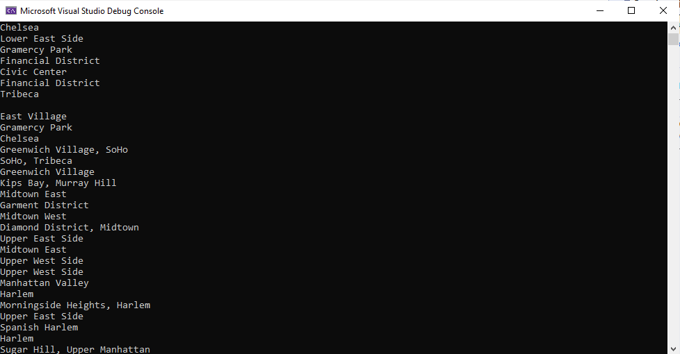
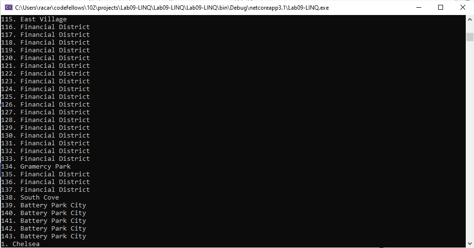
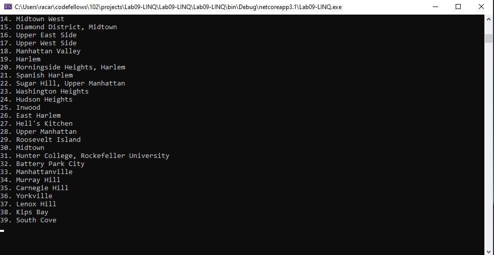
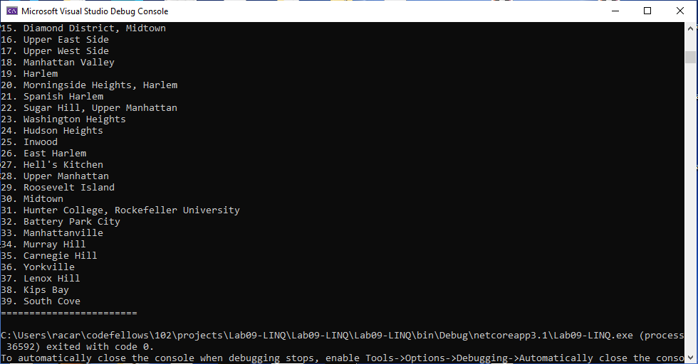

# LINQ App
##### Lab09-LINQ
##### Author: Robert Carter
##### Collaborated with: Nicholas Ryan, Bade Habib, Paul Rest

### Description

##### This is a C# console application that utilized LINQ to acces json data and mainpulate its rendering to the terminal.
##### I first created both Properties, Root, GeoLocation, and Feature classes which I used for the basis of building later in the code. I also built out the Program class to hold the methods and variables that access the json in a variety of ways. I utilized both LINQ query and LINQ method formats to access json data, specifically neighborhood names. 
##### I utilized json and LINQ throughout the app to showcase the ability to draw data and render it for a user in a variety of ways using a variety of methods.

#### Getting started

##### Clone this repository to your local machine.
###### $ git clone https://github.com/racarter1215/Lab09-LINQ.git

### To run this application from VS:

##### Select File, then Open, then Project/Solution
##### Find the location of the cloned Repository
##### Select Lab09-LINQ folder
##### Select the next Lab09-LINQ folder
##### Select the Program.cs document

### Lab 09 Solution

#### Change Log

###### 1.2: Collaboration effort made to optimize code - 16 July 2020
###### 1.1: App first created - 16 July 2020
